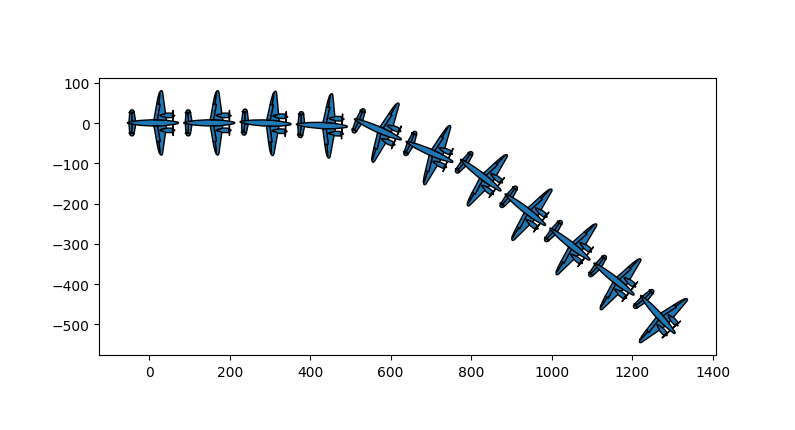
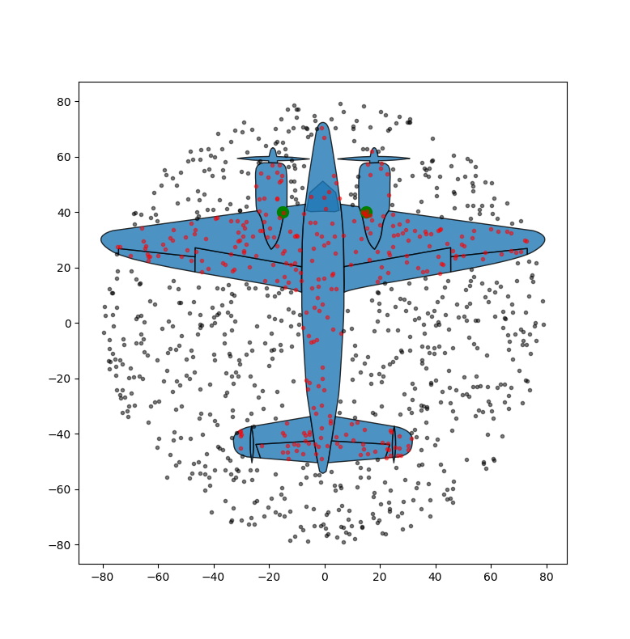

# Wald's Airplane problem

*Work in progress*

I wan't to build a statistical model to [solve this problem](https://en.wikipedia.org/wiki/Survivorship_bias#In_the_military), formally.
I want to solve it since I want to draw nice pictures of airplanes.
Everyone likes nice plots.

The likelihood will be pretty complicated, so I will use [Stan](stanhttps://mc-stan.org/
 for the parameter estimation.

But first, I need some airplane surival data

# Simulation

>Before you want to model data, try to simulate a similar dataset. It will force you to think about the problem.
> -- Brian Ripley

To simulate this, I need a way to draw little airplanes, and then I need to be able to shoot at them.
Turns out I can do most of this using [Affine_transformations](https://en.wikipedia.org/wiki/Affine%20transformation) on polygons. Making it into a little physics engine isn't that far removed.

The file [test_flight.py](./test_flight.py) draws the plane and a random flight path.

The file [test_plane_and_shooting.py](./test_plane_and_shooting.py) draws the plane and takes some random shots at it.

Next step is to work on a damage model to simulate killing the planes.
Finally, I can try to infer that damage model using statistical modeling, to see where the plane's weak points are (and help Wald determine where to re-enforce the armour).

Will also give this a proper project structure later.
